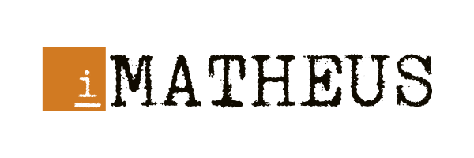

</img>

# Automata
**Just a bunch of machines which can process a bunch of words.**

According to the [Automaton Wikipedia page](https://en.wikipedia.org/wiki/Automaton), an automaton "is a self-operating machine, or a machine or control mechanism designed to automatically follow a predetermined sequence of operations, or respond to predetermined instructions." If we navigate to the [Automata theory Wikipedia page](https://en.wikipedia.org/wiki/Automata_theory), we are going to see that a type of automaton is the finite one, which is the focus of this repository. Under this page, we can see that a finite automaton is a finite-state machine, which, by its turn, "belongs to a well-known type of automaton".

>This automaton consists of states (represented in the figure by circles) and transitions (represented by arrows). As the automaton sees a symbol of input, it makes a transition (or jump) to another state, according to its transition function, which takes the current state and the recent symbol as its inputs.
>
>Automata theory is closely related to formal language theory. An automaton is a finite representation of a formal language that may be an infinite set. Automata are often classified by the class of formal languages they can recognize, typically illustrated by the Chomsky hierarchy, which describes the relations between various languages and kinds of formalized logics.

Source: [Wikipedia](https://en.wikipedia.org/wiki/Automata_theory).

---

Under this repository you are going to find the following automata:

- [Deterministic Finite Automaton](./dfa);
- [Nondeterministic Finite Automaton](./nfa); and
- [Nondeterministic Finite Automaton with ε-moves](./nfae).