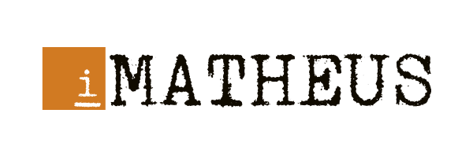

</img>

# Deterministic Finite Automaton (DFA)

**Neither empty moves, nor multiple moves from a single state: it either moves to a unique other state or it doesn't at all.**

According to [Wikipedia](https://en.wikipedia.org/wiki/Deterministic_finite_automaton), a DFA "is a finite-state machine that accepts or rejects strings of symbols and only produces a unique computation (or run) of the automaton for each input string."